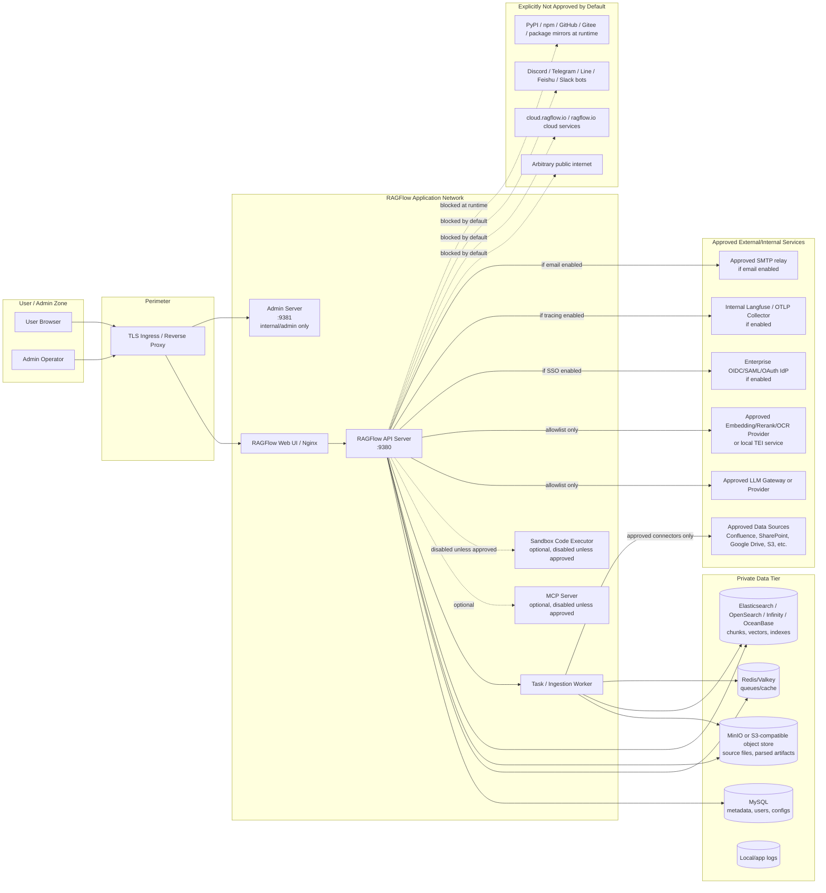
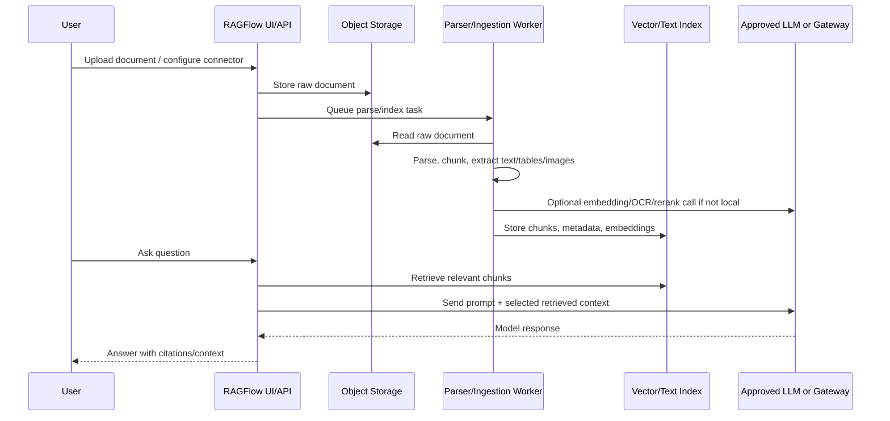

# RAGFlow Architecture and Data-Flow Diagram

## Scope

This diagram is for a **self-hosted RAGFlow deployment** based on the repository at `/Users/ankitsingh/Documents/deep-wiki/ragflow`, version `0.26.1`.

The goal is to make all expected network paths and data stores explicit so an approver can verify there is no unreviewed or hidden egress.

## Recommended deployment stance

- Run RAGFlow in an isolated application subnet or Kubernetes namespace.
- Place a reverse proxy or ingress in front of the web/API service.
- Keep databases, search engines, Redis/Valkey, MinIO/S3, NATS, and admin services on private/internal networks only.
- Deny outbound egress by default.
- Allow only explicitly approved LLM, embedding, identity, observability, storage, and connector endpoints.
- Keep code-execution sandbox disabled unless separately approved.

## High-level architecture

## Primary data flow: document ingestion to answer generation

## Trust boundaries

| Boundary | Description | Control expectation |
|---|---|---|
| User to ingress | Browser/admin access to RAGFlow | TLS, SSO, authN/authZ, rate limiting |
| App to data tier | API/worker to MySQL, Redis, object store, vector store | Private network only; no public exposure |
| App to external services | LLMs, connectors, IdP, SMTP, observability | Egress allowlist and logging |
| App to code execution | Optional sandbox executor | Disabled unless separately approved |
| Build/CI to package sources | Docker build and dependency fetches | CI-only egress, pinned artifacts, internal mirrors |

## Inbound ports and exposure recommendation

Ports below are the repository defaults from `docker/.env` and `docker/docker-compose-base.yml` / `docker-compose.yml`. **Important:** every published port in the compose files uses the short `host:container` form with **no `127.0.0.1` prefix**, so each one binds `0.0.0.0` (all host interfaces) by default. The "Published by default?" column reflects the default `elasticsearch,cpu` profile.

| Component | Repo/default host port | Published by default? | Production recommendation |
|---|---:|---|---|
| Web UI / Nginx | 80 / 443 | Yes | Expose only through enterprise ingress/load balancer |
| RAGFlow API | 9380 | Yes | Internal behind ingress; do not expose broadly |
| Admin server | 9381 | **Yes — admin server is ENABLED by default** (`--enable-adminserver` is uncommented in `docker-compose.yml`) | Comment out `--enable-adminserver` and remove the 9381 mapping; restrict to admin network/VPN |
| MCP server | 9382 | Port mapped Yes; **process off by default** (MCP flags commented) | Keep MCP process disabled; also remove the 9382 host mapping |
| Go admin / Go API | 9383 / 9384 | Yes (mapped even though `API_PROXY_SCHEME=python`, i.e. Go mode off) | Remove host mappings unless Go/hybrid mode is used |
| Sandbox executor manager | 9385 | No (profile `sandbox`) | Keep disabled; if enabled, private only (runs `privileged`, see below) |
| MySQL | 3306 (`EXPOSE_MYSQL_PORT`) | **Yes — always published** | Remove host mapping or bind `127.0.0.1`; private only |
| Redis/Valkey | 6379 | **Yes — always published** | Remove host mapping or bind `127.0.0.1`; private only |
| MinIO API / console | 9000 / 9001 | **Yes — always published** | Private only; console (9001) is the storage root account — restrict |
| Elasticsearch | 1200 (→ container 9200) | Yes (default `elasticsearch` profile) | Private only |
| OpenSearch | 1201 (→ container 9201) | Only under `opensearch` profile | Private only |
| Infinity | 23817 / 23820 / 5432 (thrift / http / psql) | Only under `infinity` profile | Private only; note 5432 collides with Postgres |
| OceanBase / SeekDB | 2881 (both — mutually exclusive) | Only under `oceanbase` / `seekdb` profile | Private only; share default password `infini_rag_flow` |
| NATS | 4222 (client) / 8222 (monitoring, hardcoded) | Only under `ragflow-go` profile | Private only; 8222 exposes server stats |
| TEI (embeddings) | 6380 (→ container 80) | Only under `tei-cpu` / `tei-gpu` profile | Private only |
| Kibana | 6601 (→ container 5601) | Only under `kibana` profile | Disabled unless needed; private only |

## Notes from repository review (verified against the source)

- **Ports / exposure.** Docker Compose publishes many service ports to `0.0.0.0` by default in `docker/.env` and `docker/docker-compose-base.yml` (MySQL/Redis/MinIO are always published; the search engine is published for the selected `DOC_ENGINE` profile). The admin server is enabled by default (`docker-compose.yml` command `--enable-adminserver`) and its port 9381 is host-published. These must be restricted for production.
- **Sandbox / code execution.** `docker/docker-compose-base.yml:158-184` defines an optional `sandbox-executor-manager` with `privileged: true` and `/var/run/docker.sock` mounted; it listens on 9385 and is gated behind the `sandbox` profile (off by default). It sets `security_opt: no-new-privileges:true`, but that is negated by `privileged: true`. Inner per-task containers rely on gVisor (`--runtime=runsc`, which the image does **not** install — must be present on the host) and have `SANDBOX_ENABLE_SECCOMP=false` by default. Separately, RAGFlow ships an in-product agent `execute_code` tool (`agent/tools/code_exec.py`) and a `local` sandbox provider (`agent/sandbox/providers/local.py`) that runs user code as a child process on the app host with **no isolation** — disabling the Docker sandbox service alone does not remove these paths. Treat all three as high-risk.
- **Default credentials.** `docker/.env` sets the same password `infini_rag_flow` for MySQL, Redis, MinIO, Elasticsearch, OceanBase and SeekDB (OpenSearch: `infini_rag_flow_OS_01`); MinIO/MySQL defaults are the storage/DB **root** accounts. The admin server seeds a default login `admin@ragflow.io` / `admin` (`admin/server/auth.py:90-99`). `REGISTER_ENABLED=1` (open signup) and `DISABLE_PASSWORD_LOGIN=false` by default. The JWT/session `RAGFLOW_SECRET_KEY` is unset and auto-generated at runtime into Redis if not provided (`common/settings.py:192-195`).
- **Config files.** `docker/service_conf.yaml.template` controls DB (MySQL/Postgres + the doc engines), storage (MinIO/S3/OSS/Azure/OpenDAL), OAuth/OIDC/GitHub (commented out by default), SMTP/email, and `user_default_llm`. It does **not** control observability — Langfuse tracing is configured per-tenant via the API and stored in the `tenant_langfuse` DB table, so it is enable-able by any tenant admin at runtime and must be controlled at the network layer. Storage backend selection is driven by the `STORAGE_IMPL` env var (default `MINIO`), not by the YAML alone.
- **Providers / connectors / channels.** `conf/llm_factories.json` defines 64 model providers and `conf/models/*.json` has 60 files (49 with an external default URL); only approved providers should be configured and reachable. `common/data_source/config.py` defines ~33 data-source connectors (Confluence/Jira, SharePoint/OneDrive/Teams/Outlook, Google Drive/Gmail, Slack, Notion, Dropbox, Box, S3, Salesforce, Zendesk, GitHub/GitLab/Bitbucket, etc.). The API server always loads 6 chat-channel integrations (`feishu, discord, telegram, line, wecom, qqbot`) via a reconciler thread — see `02` for the egress hosts.
- **Cloud endpoints.** `cloud.ragflow.io` / `ragflow.io` appear only in `README*.md` documentation, not in any runtime `.py`/`.json`/`.yaml`. The self-hosted app does not phone home to RAGFlow Cloud by default; blocking those hosts is precautionary.
